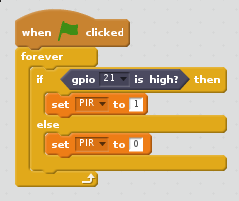

# Passive infrared motion sensor (PIR)

Humans and other animals emit heat all the time.

A PIR sensor detects changes in the amount of IR radiation (heat) it receives. When there is a change, then a pulse is triggered. This means that a PIR sensor can detect when a human (or any animal) moves in front of it.

## Wiring a PIR sensor

The pulse emitted when a PIR detects motion needs to be amplified, and so it needs to be powered. There are three pins on the PIR; they should be labelled `Vcc`, `Gnd`, and `Out`. If these labels aren't clear, they are sometimes concealed beneath the Fresnel lens (the white cap), which you can temporarily remove to see the pin labels.

`Need to change PIR to pin 21.  Pin 4 has pullup resistor and does not allow *no motion* to be detected`

1. As shown above, the `Vcc` pin needs attaching to a `5V` pin on the Raspberry Pi.
1. The `Gnd` pin on the PIR sensor can be attached to *any* ground pin on the Raspberry Pi.
1. Lastly, the `Out` pin needs to be connected to any of the GPIO pins.

## Coding a PIR sensor

1.  With your PIR circuit complete, you are now ready to use Scratch to sense motion. Launch the Scratch 2 program by clicking on **Menu** followed by **Programming** and selecting **Scratch 2**.

 Our version of Scratch on Raspbian is extra special. It allows you to access and control the GPIO pins.

 1. Enable the GPIO pin by adding the `Pi GPIO` extension from the **More Blocks** menu.

1.  Click on **events** in the top-right display. Drag the  block onto the scripts area.

1. You need to create a variable in the **data** tab called `PIR`

  

If there is an input, the value of the pin changes from `0` to `1`. As you connected the PIR sensor to GPIO pin 21 of the Pi, we need to monitor that.

1. Create the code block as shown below:

  

1. Test the PIR sensor by waving your hand in front of it. When it detects movement, the value on the screen should change from `0` to `1`.

1. If the value doesn't change, check that the correct pins are connected.

## What Next?

- Why not try and wire up a buzzer as well, to make a burglar alarm?
- Have a go at making a [Santa Detector](https://www.raspberrypi.org/learning/santa-detector/)

Back to [Physical computing with Scratch](worksheet.md)
